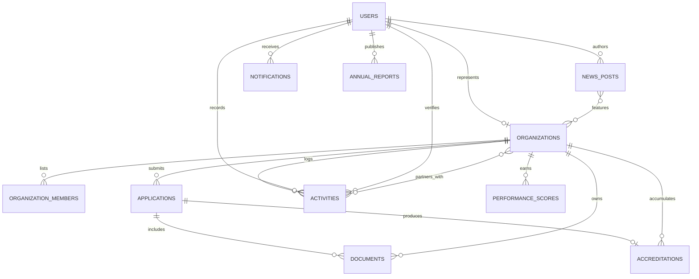

# Project Requirements Document
## Lingayen CivicLink

**Prepared for:** PESO Lingayen, Pangasinan (Civil Society Desk Office)
**Document version:** 3.0 (client interview round 2 integrated — real operational data, Milestone 1 reviewed)
**Status:** Final — supersedes `PRD_Lingayen_CSO_System.md` and `PRD_Phase1_Client_Demo.md`.
Delete those two once this file is in your repo to avoid the exact confusion this replaces.
Milestone 1 has been built and reviewed; see Section 19 for what in the existing build needs to
be reconciled against the real data gathered in this round.

---

## 1. Executive Summary

PESO Lingayen currently accredits Civil Society Organizations (CSOs) through a fully paper-based
process — physical visits, printed forms, a logbook at the Sangguniang Bayan (SB) Secretariat,
and phone-call status checks. This creates delays, lost records, and no visibility for
applicants.

Lingayen CivicLink replaces the accreditation process with a browser-based platform, and —
in response to panel feedback that a "submit once every four years" system does not justify a
website — extends beyond accreditation into an **ongoing CSO monitoring and analytics platform**.
Accreditation is the entry point; continuous activity logging, verifiable digital credentials,
performance scoring, and public transparency reporting are what keep the system in active,
recurring use.

## 2. Problem Statement

1. Paper-based accreditation is slow, error-prone, and gives applicants no status visibility.
2. A system limited to accreditation alone is used once every ~4 years (tied to the local
   election cycle) and does not justify a standalone website.
3. PESO has no structured way to measure or report on CSO performance and community contribution
   over time.
4. A meaningful share of CSO members have low literacy, requiring accommodations beyond a
   standard web form.
5. Existing CSO accreditation systems (e.g. PCNC) are static one-time directories with no ongoing
   monitoring, verification, or analytics layer — the adviser has required the system to be
   substantially (≈75%) differentiated from this baseline.
6. **Confirmed directly by the Civil Society Desk Officer:** accreditation review in practice is
   not rigorous. Applications are effectively approved as early as the first SB reading regardless
   of merit, there is no revocation mechanism once accredited, and organizations frequently apply
   to access LGU benefits (e.g. fuel subsidies for TODA members) without conducting the community
   activities their accreditation is meant to represent. Participation in LGU-organized events is
   generally good; independent, self-initiated advocacy work is, in the office's own words, "almost
   nothing" for a large share of accredited CSOs. This is the clearest real-world evidence for why
   an accreditation-only system is insufficient — it also validates the ongoing activity-monitoring
   and scorecard design as a direct answer to a problem PESO already knows it has, not a feature
   invented for novelty's sake.

## 3. Objectives

- Digitize the accreditation application, review, and SB Secretariat deliberation workflow.
- Maintain a public, PESO-moderated directory of accredited CSOs with real PSA-sourced barangay
  data.
- Enable continuous, PESO-verified activity/advocacy logging, including cross-CSO collaboration
  tagging.
- Issue tamper-evident, QR-verifiable digital accreditation certificates.
- Pre-screen uploaded documents with OCR before they reach PESO's review queue.
- Compute a transparent, equally-weighted performance score per CSO from logged activity.
- Deliver renewal and expiry reminders through both email and SMS.
- Provide PESO with an analytics dashboard, PDF exports, and content management for news and
  annual reports.
- Accommodate low-literacy users through assisted encoding and a downloadable paper-equivalent
  form that converges into the same digital record.
- Give PESO a direct way to identify consistently inactive or non-compliant CSOs, something no
  part of the current paper process supports today.
- Provide a defensible, data-backed basis for the office's planned Outstanding CSO recognition
  program, using the same performance scorecard already built for Milestone 1.

## 4. Scope

### 4.1 In scope

- Online accreditation application (new + renewal), with document upload, or a downloadable
  fillable PDF that converges into the same application record (`submission_channel`: online /
  assisted)
- Automated document validation and expiry tracking, including OCR-based pre-check of uploaded
  documents against expected content
- PESO review workflow and SB Secretariat reading-stage tracking (tracked as data, not a login)
- QR-verifiable digital accreditation certificate with a public, real-time verification page
- Public CSO directory with search/filter, using official PSGC barangay data
- Organization profile (org chart, advocacy statement, sector, barangay)
- Recurring activity/advocacy logging with PESO verification, including cross-CSO activity
  tagging (multiple organizations credited on one logged activity)
- Weighted performance scorecard — equal-weighted (25% activity frequency / 25% community reach /
  25% compliance timeliness / 25% document currency), informational only, does not affect
  renewal decisions
- Analytics dashboard (sector distribution, activity volume trend, top contributors, compliance
  trend)
- Renewal and document-expiry reminders, delivered via email and SMS
- PESO-authored public news/community update posts (multi-CSO tagging)
- Admin-managed annual reports on the public Resources page; FAQ content static
- PDF and Excel report export (client-requested: PESO wants both formats, not PDF alone)
- Printable (PDF) officer/member list per organization, for PESO's internal records

### 4.2 Explicitly out of scope

- Mobile application, offline mode
- SEC/DSWD/DOLE system integration
- HRMO payroll or internal PESO staff management functions
- CSO financial/fund tracking
- Predictive analytics or machine learning (analytics is descriptive/aggregate only)
- Community feedback or ratings on CSO programs (would require a new respondent group and data
  instrument beyond current methodology)
- Barangay-level map visualization
- Recognition/longevity badges
- Online fee/payment collection — the real process includes a ₱500 (renewal, sometimes waived)
  or ₱1,000 (new, via Municipal Treasury) accreditation fee, but the system only stores the
  uploaded payment receipt as a supporting document; it does not process or reconcile payments

## 5. Stakeholders and User Roles

| Role | Login required | Core purpose |
|---|---|---|
| PESO Administrator | Yes | Review/approve applications, verify activities, moderate directory, manage analytics/reports/news/annual reports |
| CSO Representative | Yes (one account per organization) | Apply/renew, manage org profile, log activities, self-monitor status and score |
| Public Viewer | No | Browse the directory, verify certificates, read public updates, view transparency stats |

## 6. Functional Requirements by Role

### 6.1 PESO Administrator
1. Login / role-based access
2. Application review queue — approve/reject, track SB reading stage
3. Document validation review, including OCR pre-check flags
4. Organization directory moderation (`public_visibility` control)
5. Activity verification queue — approve/reject before it counts toward the score, including
   verifying cross-CSO tags on an activity
6. Performance scorecard computation and per-organization view
7. Analytics & Reports dashboard (sector distribution, activity trend, top contributors,
   compliance trend)
8. News/community post authoring (multi-CSO tagging, publish/draft)
9. Annual report management (upload/edit)
10. PDF and Excel report export — both generated from the same underlying data the Analytics &
    Reports dashboard aggregates from (Section 9), not a separate or manually-compiled process;
    reports are a formatted output of the single data pipeline that also feeds the dashboard
11. Printable officer/member list per organization (PDF) — client-requested for internal records
12. Assisted encoding — submit an application or log an activity on behalf of a CSO
13. Internal notifications (pending reviews, upcoming renewals)

### 6.2 CSO Representative
1. Registration / login (one account per organization)
2. Application submission — new and renewal, document upload, or attach a scanned copy of the
   downloadable PDF form
3. Real-time application status tracking, including SB reading stage
4. Organization profile management (org chart, advocacy statement, sector, barangay via live
   PSGC data)
5. Activity/advocacy logging — held as `pending` until PESO verification; can tag partner CSOs
   on a shared activity
6. Digital accreditation certificate — view/download own certificate with its QR code
7. Self-service dashboard — accreditation status, performance score, activity history,
   renewal/document-expiry countdown
8. Notifications — status changes, renewal and document-expiry reminders, via email and SMS

### 6.3 Public Viewer
1. Home — hero, CSO definition, advocacy sections, transparency stats, featured CSOs, news
   preview
2. About Us — purpose, history, Lingayen office officials, legal basis for CSO participation
3. Accreditation — guidelines, process, downloadable PDF form, online application entry point
4. Accredited CSOs — searchable/filterable directory (sector, barangay), summary profile on click
5. Certificate verification — scan a certificate's QR code or enter its code to confirm
   accreditation status live
6. Resources — annual reports, news, CSO-related regulations, FAQ
7. Entry points only: Apply Now, Contact Us, Log In (no public account creation for admin)

## 7. Non-Functional Requirements

- **Security:** role-based access control enforced at the route/middleware level (not just
  hidden UI links); password hashing; CSRF protection; reCAPTCHA on the public application form;
  file-upload validation on document and logo uploads
- **Privacy:** public directory shows organization-level information only — individual member
  names and contact details are visible to PESO admins only
- **Accessibility:** assisted encoding for low-literacy users; minimal free-text fields in favor
  of structured inputs; downloadable PDF as an offline-friendly alternate channel
- **Availability:** hosted for pre-defense compliance (Section 12); local environment used for
  primary development
- **Usability:** distinct visual/interaction density per role — public pages optimized for
  browsing, admin pages optimized for scanning and processing queues

## 8. Backend Implementation Standards

"Solid" means correct, validated, and secure — not heavily layered. A Controller talking
directly to a well-validated Model is solid; a Controller → Service → Repository stack for a
project this size is not "more solid," it's more surface area to get wrong. Keep structure flat
unless a specific piece genuinely needs separating (ponytail's discipline applies here, not in
tension with this section).

**Every write endpoint:**
- A Form Request class per create/update action — validation rules live there, not scattered in
  controllers
- Authorization enforced in Policies and route middleware, checked at the route/controller level
  — never assume a hidden UI link is a secured route
- File uploads (documents, logos) validated for mime type and size before storage; stored outside
  the public web root or served through a signed/controlled route

**Data integrity:**
- Multi-step writes happen inside a database transaction — approving an application, creating the
  `accreditations` record (with its `verification_code`), and updating `applications.status`
  must succeed or fail together
- Foreign keys defined with explicit `onDelete` behavior
- A uniqueness constraint preventing two active `accreditations` rows for the same organization

**Error handling:**
- Custom error responses for 403/404/419/500 — no raw debug traces shown to a client or panel
- Laravel's logging catches failed jobs and exceptions; check the log after each build session

**Demo reliability:**
- A `DatabaseSeeder` that recreates realistic sample data in one command
  (`php artisan migrate:fresh --seed`) — organizations in different states, applications at
  different review stages, a mix of verified and pending activities

**Verification:** run `$tester` after each backend module, specifically on auth, file uploads,
role-based access, and the certificate verification endpoint (a public, unauthenticated route —
worth extra scrutiny since it's the one place unauthenticated users can query real data).

## 9. Data Model

Eleven core entities: `users`, `organizations`, `organization_members`, `applications`,
`documents`, `accreditations`, `activities`, `performance_scores`, `news_posts`,
`notifications`, `annual_reports` — plus two pivot tables: `news_post_organization` (multi-CSO
news tagging) and `activity_organization` (cross-CSO activity tagging).

Key relationships:
- One `organizations` record links to exactly one `users` account (`cso_rep` role)
- `applications` produces an `accreditations` record on approval, which carries a unique
  `verification_code` used by the public certificate-verification page
- `documents.ocr_status` records the result of the automated content pre-check
- `activities` requires both a submitter (`logged_by`) and a verifier (`verified_by`) before
  counting toward `performance_scores`, and can be linked to multiple partner `organizations`
- `organizations.barangay_psgc_code` stores the official PSA barangay code alongside the display
  name
- `notifications.channel` records whether a given notification was sent in-app, by email, or by
  SMS



**Performance score formula (confirmed — equal split):**

```
score = (0.25 × activity_frequency) + (0.25 × community_reach)
      + (0.25 × compliance_timeliness) + (0.25 × document_currency)
```

Equal weighting was chosen deliberately: since the score is informational only and does not
affect renewal decisions, the simplest, most neutral formula is also the easiest to defend — no
single dimension is privileged over another. The client has reviewed the formula directly and is
satisfied with the equal-weighted approach; the one change requested is that sectors be organized
according to the office's actual taxonomy (see Section 19) rather than the placeholder categories
used while this data was unavailable.

**Real dataset now available, pending import:** 202 registered associations, active and
inactive, provided as a complete list with names and sector classifications — see Section 19 for
how this replaces the current placeholder/seed data.

## 10. Legal and Regulatory Basis

CSO participation in Philippine local governance is grounded in the Local Government Code
(RA 7160), which directs LGUs to help establish and support people's and non-governmental
organizations as active partners in governance. Local Special Bodies — the Local Development
Council, Local Health Board, Local School Board, and Local Peace and Order Council — are
required by law to include CSO representation. DILG Memorandum Circular 2022-083 sets the
accreditation and selection guidelines LGUs use to bring CSOs into those bodies — the direct
legal ancestor of this system's accreditation process.

## 11. UI and Design Direction

- **Navigation (public):** Home | About Us | Accreditation | Accredited CSOs | Resources, with
  Apply Now / Contact Us / Log In as utility links
- **Visual system (confirmed via direct screenshot, supersedes the earlier filename-based guess):**
  Milestone 1 was built with a navy/amber civic palette (see `DESIGN_SYSTEM.md`). A screenshot of
  the live lingayen.gov.ph site shows its actual scheme is **magenta/hot pink as the primary
  accent, with navy blue as the secondary color** — not maroon, which was an incorrect inference
  from a logo filename and should be disregarded. The real site uses: a pink top utility bar, a
  pink hero banner over grayscale event photography, a navy-and-pink bordered content block
  beneath it, and the official circular seal (navy/gold/red, "Bayan ng Lingayen") in the nav.
  Recommend updating the design system's accent color from amber to a magenta/pink in the same
  family as the municipal site, keeping navy as the primary — this is now a confirmed match
  rather than an open question, and should be treated as the default direction unless the client
  says otherwise.
- **Tone:** client explicitly described CSOs as apolitical and asked that the design not stray
  far from current conventions — restrained, institutional, consistent with the existing
  public-sector tone already specified in `DESIGN_SYSTEM.md` §0. This confirms rather than
  changes the original design read.
- **Office branding:** the client wants the office identified as the "CSO Desk Office" — the
  actual functional name of the role, distinct from "PESO" generally. Integrate this into the
  Home page welcome copy and About Us; the site name itself stays **Lingayen CivicLink**, not
  renamed.
- **Directory ordering (confirmed):** barangay first, then sector — update the directory filter
  and card layout order accordingly (previously an open question).
- **Dashboards:** three true personalized dashboards (Admin operational, Admin Analytics &
  Reports, CSO self-service); the public Home page is a landing page, not a dashboard
- **Login:** single shared login form, role-checked post-authentication; registration is a
  separate path for new CSOs only; admin accounts are never self-registered
- **Branding assets:** client will supply official logos (PESO/CSO Desk Office, Lingayen LGU
  seal, and individual CSO logos) via file upload — do not approximate or reproduce the municipal
  seal without the official file, per Municipal Ordinance No. 79, s-2019. Use a placeholder badge
  until received and confirmed as current.
- **Event/activity imagery:** no real photos supplied yet. Continue using properly-licensed stock
  images (Unsplash/Pexels) as a temporary placeholder; swap for real imagery once the client
  provides any, which was raised directly in the interview as still outstanding.
- **About Us — real officials (replaces placeholder):**
  - Hon. Josefina "Iday" V. Castañeda — Municipal Mayor
  - Hon. Jay Mark Kevin D. Crisostomo — Municipal Vice Mayor
  - Van Macley Moulic — Civil Society Desk Officer (the project's client contact)
- **Contact details — real (replaces placeholder):**
  - Address: #1 Bengson Street, Lingayen, Pangasinan, 2401 (matches the address published on
    lingayen.gov.ph — consistent across both sources)
  - Facebook: facebook.com/pesolingayen/
  - Phone and email: pending confirmation from the client
  - Office hours: 7:00 AM – 6:00 PM, **Monday to Thursday** — confirm with the client whether the
    office is closed Friday–Sunday or simply keeps different hours those days, since this departs
    from the Monday–Friday placeholder previously assumed

## 12. Third-Party Services and Free APIs

| Service | Powers | Cost |
|---|---|---|
| PSGC API / `edeesonopina/laravel-psgc-api` | Official barangay/city/province data for dropdowns | Free, official PSA data |
| Tesseract.js | OCR document pre-check | Free, open source, runs locally |
| `simple-qrcode` (Laravel package) | QR code generation for certificates | Free, no external API call |
| Brevo (`kreatif/laravel-brevo-mailer` or similar) | Email + SMS notifications | Free tier: 300 emails/day |
| Google reCAPTCHA | Spam protection on the public application form | Free |
| `barryvdh/laravel-dompdf` | Certificates, PDF report exports | Free, open source |
| `maatwebsite/excel` (Laravel Excel) | Excel export of reports and officer/member lists, alongside PDF | Free, open source |

## 13. Deployment and Hosting

Pre-defense compliance requires a live, hosted URL. Recommended: free PHP/MySQL hosting (e.g.,
InfinityFree) with manual `public/` folder restructuring and vendor upload, given no SSH/Composer
access on free shared tiers. `QUEUE_CONNECTION=sync` and login-triggered expiry checks substitute
for the unavailable scheduler/queue workers. Local MySQL (XAMPP/Herd + DBngin) remains the
primary development environment. Free/shared hosting is adequate for compliance and
demonstration only — a genuine production rollout handling real member data would require
LGU-approved, properly secured hosting.

## 14. Development Timeline

Two milestones, one continuous build — the client demo is a checkpoint within the full schedule,
not a separate project.

**Milestone 1 — Client demo (Days 1–6, live/local, core features only)**

| Day | Focus |
|---|---|
| 1 | Migrations from the schema above; authentication and role-based routing, live |
| 2 | Static front-end for every screen, following `DESIGN_SYSTEM.md` |
| 3 | Accreditation flow wired live: submit → validate → PESO review → SB stage → approve; organization profile CRUD |
| 4 | Activity logging and PESO verification live; Analytics & Reports dashboard and performance scorecard, live |
| 5 | News post authoring and annual reports CMS wired live |
| 6 | Realistic placeholder content, seed data, end-to-end testing, client walkthrough rehearsal |

*Deferred past Milestone 1: QR certificates, OCR pre-check, PSGC live data, SMS notifications,
cross-CSO tagging — added in Milestone 2 below, after client feedback is incorporated.*

**Milestone 2 — Full build to defense (Days 7–20)**

| Days | Focus |
|---|---|
| 7–8 | Incorporate client feedback from Milestone 1 review |
| 9–10 | QR-verifiable certificate generation and public verification page |
| 11–12 | OCR document pre-check; PSGC live barangay data integration |
| 13–14 | Brevo email/SMS notifications; cross-CSO activity tagging |
| 15–16 | Full analytics refinement, PDF exports, remaining polish |
| 17–18 | Deploy for pre-defense hosting compliance |
| 19–20 | Full security testing (`$tester` across every module), final data seeding, defense rehearsal |

**Fallback discipline:** if any day slips, protect the core accreditation-and-monitoring loop
(Milestone 1, Days 1–4) above every new feature — that loop is what proves the central thesis
argument. New features degrade gracefully to "documented as future work" if time runs out; the
core loop does not have that option.

## 15. Risks and Mitigations

| Risk | Mitigation |
|---|---|
| Low CSO adoption of activity logging undermines the "not stagnant" argument | Assisted encoding lets PESO log on a CSO's behalf; framed as adoption-dependent in the defense |
| Performance score perceived as disadvantaging smaller/newer CSOs | Confirmed informational only — stated explicitly on the CSO-facing score display and in the defense |
| PESO verification workload grows with activity + cross-tagging volume | Documented as a known limitation; batch-review UI named as future work |
| Free hosting tier limitations (no scheduler/queue) | Login-triggered checks substitute for cron |
| New-feature scope (QR/OCR/SMS/tagging) risks destabilizing the working Milestone 1 build | Built only after Milestone 1 is demoed and stable, in a separate timeline block (Milestone 2) |
| Municipal seal used incorrectly | Real logo requested directly from client; placeholder used until supplied, per Ordinance No. 79, s-2019 |

## 16. Success Criteria

**Milestone 1 (client demo):** all three role experiences live and functional; visual
consistency per `DESIGN_SYSTEM.md`; the core loop — submit → review → approve → log activity →
verify → score → dashboard — works end to end with real data; client can clearly distinguish
what's built from what's coming next.

**Milestone 2 (defense):** all Milestone 1 criteria hold, plus: QR certificates generate and
verify correctly; OCR flags at least obviously mismatched documents; PSGC data populates
barangay fields live; email and SMS reminders fire correctly; cross-CSO tagging displays on both
organizations' activity histories; system is reachable via a live hosted URL.

## 17. Proposal Defense Compliance Matrix Traceability

Cross-reference against the Proposal Defense compliance matrix (May 19, 2025) to confirm every
panel recommendation is either addressed in this system or correctly identified as a manuscript
(not system) task.

| # | Recommendation | Status | PRD Reference |
|---|---|---|---|
| 1 | Should be hosted during pre-final | Covered | Section 13, Deployment and Hosting |
| 2 | Reports generated based on PESO as output and feed to data analytics | Covered — reports (Section 6.1.10) are generated from the same underlying data the Analytics & Reports dashboard (Section 6.1.7) aggregates from; one pipeline, two outputs, not a separate manual process | Sections 6.1, 9 |
| 3 | Include data analytics capabilities | Covered | Section 6.1.7, Section 12 |
| 4 | How organizations are assessed as to their performance | Covered | Section 9, performance scorecard formula |
| 5 | Objectives: process w/ challenges encountered; design and develop appropriate features | Not a system feature — this is a Chapter 1 Objectives writing task | Outside PRD scope; use content from Section 18 below |
| 6 | Identifying the process of the PESO Accreditation | Not a system feature — narrate the workflow in Chapter 1; the built implementation is documented in Section 6 | Outside PRD scope (system side: Sections 6.1.2–6.1.3) |

## 18. Data and Documentation Required from PESO Lingayen

Requested ahead of the client consultation, organized by what each item feeds.

**For the data model (Section 9) — replaces placeholder/seed data with real records**
- Current list of accredited and pending CSOs: name, sector, barangay, address, advocacy
  statement, officers/members, current accreditation validity dates
- The sector/category taxonomy PESO actually uses for classification
- Historical accreditation records, if digitized or available, for seeding and for the annual
  reports content

**For the accreditation workflow (Sections 6.1–6.2) — makes the form and process accurate**
- A copy of the current paper accreditation form, so the online form and downloadable PDF
  mirror its exact fields rather than an assumed equivalent
- The exact list of mandatory supporting documents, and any differences between new-applicant
  and renewal requirements
- The SB Secretariat's actual terminology and sequence for the reading-stage process

**For compliance item #2 specifically — existing report formats**
- Copies of any reports PESO currently produces manually (compliance summaries, pending
  application lists, etc.), so the system's PDF export matches a format they already recognize
  rather than introducing an unfamiliar one

**For Chapter 1 (items #5 and #6 above) — manuscript content, not system content**
- A description, in PESO's own words if possible, of the accreditation process today and the
  main challenges they encounter with it (feeds compliance item #5, part 1)
- Confirmation of the accreditation objectives as PESO would state them (feeds compliance item
  #5, part 2, and item #6)

**For branding and content (Section 11) — replaces AI-generated placeholder feel**
- Official PESO Lingayen and Lingayen LGU logos/seals (vector if available); per Municipal
  Ordinance No. 79, s-2019, the seal must be the authentic file, not an approximation
- Real photographs from past CSO events or PESO activities
- PESO office officials' names and titles, and a short history of the office's CSO accreditation
  work, for the About Us page
- Office address, phone, email, and hours for the footer and Contact page

**For monitoring and scoring (Section 9) — confirms the system reflects real priorities**
- Reaction to the equal-weighted performance scorecard (25/25/25/25) — confirm or request
  adjustment now that they can see it in the working prototype
- Any KPIs or criteria PESO already informally tracks for CSOs, even outside a system

## 19. Milestone 1 Reconciliation — Build vs. Real Client Data

Milestone 1 was built before this interview round, using reasonable placeholder data. It is
solid and functionally correct end to end (live accreditation loop, role-based access, document
upload, scorecard, analytics, news/reports CMS all verified working). The items below are not
bugs — they're placeholders that now have real answers and should be updated in Milestone 2
before this goes in front of the panel.

**`config/sectors.php`** currently holds 12 generic categories (Health, Education, Environment,
Livelihood and Cooperatives, Women's Welfare, Youth and Sports, Senior Citizens, Disaster Risk
Reduction, Agriculture and Fisheries, Persons with Disabilities, Indigenous Peoples, General).
Replace with the office's real 10-category taxonomy: Health, Cooperative, Farmers and
Fisherfolks, KALIPI (Women's), OFW, Pedicab Drivers, Rural Improvement Club, Senior Citizen,
TODA, Independent Organizations.

**`config/document_types.php`** currently lists 6 items, several of which (`financial_statement`,
`work_program`, `barangay_clearance`) aren't part of the real requirement list, and all are
currently marked required in `StoreApplicationRequest`. Replace with the real 5-item list —
Accomplished Accreditation Form, Updated List of Officers and Members, Constitution and By-Laws,
Accreditation Fee Receipt — and mark the DOLE/SEC Certification as **optional**, since the client
confirmed it's only submitted "if they have" one, not universally required. Note the real process
also calls for 2 copies of each document and a distinct renewal fee (₱500, sometimes waived) vs.
new-application fee (₱1,000) — the system doesn't need to model the copy count or process
payment, but the receipt upload and optional-SEC logic are real validation changes.

**`config/office.php`** currently holds placeholder officials, process steps, and FAQ content.
Officials, address, and office hours now have real values (Section 11). The 5-step process
description should be revised once the client confirms the actual number of SB readings (he
flagged this as unconfirmed, not necessarily three as originally assumed) — don't guess at this,
wait for his confirmation rather than publishing an unverified process on the public site.

**`config/barangays.php`** needs no change — it already reflects Lingayen's real barangays and
remains correct until the PSGC integration lands in Milestone 2 as originally planned.

**Color system** — resolved. Section 11 now confirms, via a direct screenshot of the live
municipal site, that the accent should shift from amber to a magenta/pink in the lingayen.gov.ph
family, keeping navy as primary. Update `DESIGN_SYSTEM.md` §1 and `tailwind.config.js` together
so the token definitions and the actual config never drift apart.

**202-organization dataset and CSO logos** — pending import once the client's file upload is
received; build the seeder/import path generically now so dropping in the real list doesn't
require new code, just a data load.

## 20. References

- RA 7160, Local Government Code of 1991, Chapter IV (Role of NGOs/POs) and provisions on Local
  Special Bodies
- DILG Memorandum Circular 2022-083, accreditation and selection guidelines for CSO
  representation in Local Special Bodies
- Municipality of Lingayen Ordinance No. 79, s-2019 (official seal)
- Chapter 1 and Chapter 3 of the group's thesis manuscript (uploaded source documents)