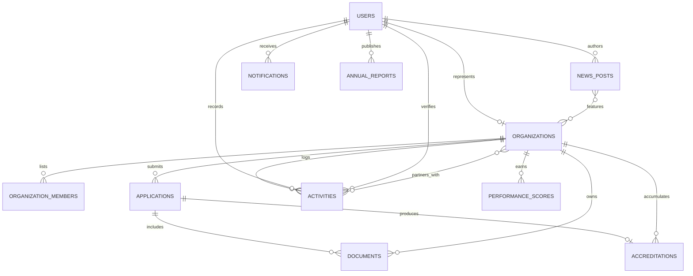

# Project Requirements Document
## Lingayen CivicLink

**Prepared for:** PESO Lingayen, Pangasinan
**Document version:** 2.0 (complete, consolidated)
**Status:** Final — supersedes `PRD_Lingayen_CSO_System.md` and `PRD_Phase1_Client_Demo.md`.
Delete those two once this file is in your repo to avoid the exact confusion this replaces.

---

## 1. Executive Summary

PESO Lingayen currently accredits Civil Society Organizations (CSOs) through a fully paper-based
process — physical visits, printed forms, a logbook at the Sangguniang Bayan (SB) Secretariat,
and phone-call status checks. This creates delays, lost records, and no visibility for
applicants.

Lingayen CivicLink replaces the accreditation process with a browser-based platform, and —
in response to panel feedback that a "submit once every four years" system does not justify a
website — extends beyond accreditation into an **ongoing CSO monitoring and analytics platform**.
Accreditation is the entry point; continuous activity logging, verifiable digital credentials,
performance scoring, and public transparency reporting are what keep the system in active,
recurring use.

## 2. Problem Statement

1. Paper-based accreditation is slow, error-prone, and gives applicants no status visibility.
2. A system limited to accreditation alone is used once every ~4 years (tied to the local
   election cycle) and does not justify a standalone website.
3. PESO has no structured way to measure or report on CSO performance and community contribution
   over time.
4. A meaningful share of CSO members have low literacy, requiring accommodations beyond a
   standard web form.
5. Existing CSO accreditation systems (e.g. PCNC) are static one-time directories with no ongoing
   monitoring, verification, or analytics layer — the adviser has required the system to be
   substantially (≈75%) differentiated from this baseline.

## 3. Objectives

- Digitize the accreditation application, review, and SB Secretariat deliberation workflow.
- Maintain a public, PESO-moderated directory of accredited CSOs with real PSA-sourced barangay
  data.
- Enable continuous, PESO-verified activity/advocacy logging, including cross-CSO collaboration
  tagging.
- Issue tamper-evident, QR-verifiable digital accreditation certificates.
- Pre-screen uploaded documents with OCR before they reach PESO's review queue.
- Compute a transparent, equally-weighted performance score per CSO from logged activity.
- Deliver renewal and expiry reminders through both email and SMS.
- Provide PESO with an analytics dashboard, PDF exports, and content management for news and
  annual reports.
- Accommodate low-literacy users through assisted encoding and a downloadable paper-equivalent
  form that converges into the same digital record.

## 4. Scope

### 4.1 In scope

- Online accreditation application (new + renewal), with document upload, or a downloadable
  fillable PDF that converges into the same application record (`submission_channel`: online /
  assisted)
- Automated document validation and expiry tracking, including OCR-based pre-check of uploaded
  documents against expected content
- PESO review workflow and SB Secretariat reading-stage tracking (tracked as data, not a login)
- QR-verifiable digital accreditation certificate with a public, real-time verification page
- Public CSO directory with search/filter, using official PSGC barangay data
- Organization profile (org chart, advocacy statement, sector, barangay)
- Recurring activity/advocacy logging with PESO verification, including cross-CSO activity
  tagging (multiple organizations credited on one logged activity)
- Weighted performance scorecard — equal-weighted (25% activity frequency / 25% community reach /
  25% compliance timeliness / 25% document currency), informational only, does not affect
  renewal decisions
- Analytics dashboard (sector distribution, activity volume trend, top contributors, compliance
  trend)
- Renewal and document-expiry reminders, delivered via email and SMS
- PESO-authored public news/community update posts (multi-CSO tagging)
- Admin-managed annual reports on the public Resources page; FAQ content static
- PDF report export

### 4.2 Explicitly out of scope

- Mobile application, offline mode
- SEC/DSWD/DOLE system integration
- HRMO payroll or internal PESO staff management functions
- CSO financial/fund tracking
- Predictive analytics or machine learning (analytics is descriptive/aggregate only)
- Community feedback or ratings on CSO programs (would require a new respondent group and data
  instrument beyond current methodology)
- Barangay-level map visualization
- Recognition/longevity badges

## 5. Stakeholders and User Roles

| Role | Login required | Core purpose |
|---|---|---|
| PESO Administrator | Yes | Review/approve applications, verify activities, moderate directory, manage analytics/reports/news/annual reports |
| CSO Representative | Yes (one account per organization) | Apply/renew, manage org profile, log activities, self-monitor status and score |
| Public Viewer | No | Browse the directory, verify certificates, read public updates, view transparency stats |

## 6. Functional Requirements by Role

### 6.1 PESO Administrator
1. Login / role-based access
2. Application review queue — approve/reject, track SB reading stage
3. Document validation review, including OCR pre-check flags
4. Organization directory moderation (`public_visibility` control)
5. Activity verification queue — approve/reject before it counts toward the score, including
   verifying cross-CSO tags on an activity
6. Performance scorecard computation and per-organization view
7. Analytics & Reports dashboard (sector distribution, activity trend, top contributors,
   compliance trend)
8. News/community post authoring (multi-CSO tagging, publish/draft)
9. Annual report management (upload/edit)
10. PDF report export
11. Assisted encoding — submit an application or log an activity on behalf of a CSO
12. Internal notifications (pending reviews, upcoming renewals)

### 6.2 CSO Representative
1. Registration / login (one account per organization)
2. Application submission — new and renewal, document upload, or attach a scanned copy of the
   downloadable PDF form
3. Real-time application status tracking, including SB reading stage
4. Organization profile management (org chart, advocacy statement, sector, barangay via live
   PSGC data)
5. Activity/advocacy logging — held as `pending` until PESO verification; can tag partner CSOs
   on a shared activity
6. Digital accreditation certificate — view/download own certificate with its QR code
7. Self-service dashboard — accreditation status, performance score, activity history,
   renewal/document-expiry countdown
8. Notifications — status changes, renewal and document-expiry reminders, via email and SMS

### 6.3 Public Viewer
1. Home — hero, CSO definition, advocacy sections, transparency stats, featured CSOs, news
   preview
2. About Us — purpose, history, Lingayen office officials, legal basis for CSO participation
3. Accreditation — guidelines, process, downloadable PDF form, online application entry point
4. Accredited CSOs — searchable/filterable directory (sector, barangay), summary profile on click
5. Certificate verification — scan a certificate's QR code or enter its code to confirm
   accreditation status live
6. Resources — annual reports, news, CSO-related regulations, FAQ
7. Entry points only: Apply Now, Contact Us, Log In (no public account creation for admin)

## 7. Non-Functional Requirements

- **Security:** role-based access control enforced at the route/middleware level (not just
  hidden UI links); password hashing; CSRF protection; reCAPTCHA on the public application form;
  file-upload validation on document and logo uploads
- **Privacy:** public directory shows organization-level information only — individual member
  names and contact details are visible to PESO admins only
- **Accessibility:** assisted encoding for low-literacy users; minimal free-text fields in favor
  of structured inputs; downloadable PDF as an offline-friendly alternate channel
- **Availability:** hosted for pre-defense compliance (Section 12); local environment used for
  primary development
- **Usability:** distinct visual/interaction density per role — public pages optimized for
  browsing, admin pages optimized for scanning and processing queues

## 8. Backend Implementation Standards

"Solid" means correct, validated, and secure — not heavily layered. A Controller talking
directly to a well-validated Model is solid; a Controller → Service → Repository stack for a
project this size is not "more solid," it's more surface area to get wrong. Keep structure flat
unless a specific piece genuinely needs separating (ponytail's discipline applies here, not in
tension with this section).

**Every write endpoint:**
- A Form Request class per create/update action — validation rules live there, not scattered in
  controllers
- Authorization enforced in Policies and route middleware, checked at the route/controller level
  — never assume a hidden UI link is a secured route
- File uploads (documents, logos) validated for mime type and size before storage; stored outside
  the public web root or served through a signed/controlled route

**Data integrity:**
- Multi-step writes happen inside a database transaction — approving an application, creating the
  `accreditations` record (with its `verification_code`), and updating `applications.status`
  must succeed or fail together
- Foreign keys defined with explicit `onDelete` behavior
- A uniqueness constraint preventing two active `accreditations` rows for the same organization

**Error handling:**
- Custom error responses for 403/404/419/500 — no raw debug traces shown to a client or panel
- Laravel's logging catches failed jobs and exceptions; check the log after each build session

**Demo reliability:**
- A `DatabaseSeeder` that recreates realistic sample data in one command
  (`php artisan migrate:fresh --seed`) — organizations in different states, applications at
  different review stages, a mix of verified and pending activities

**Verification:** run `$tester` after each backend module, specifically on auth, file uploads,
role-based access, and the certificate verification endpoint (a public, unauthenticated route —
worth extra scrutiny since it's the one place unauthenticated users can query real data).

## 9. Data Model

Eleven core entities: `users`, `organizations`, `organization_members`, `applications`,
`documents`, `accreditations`, `activities`, `performance_scores`, `news_posts`,
`notifications`, `annual_reports` — plus two pivot tables: `news_post_organization` (multi-CSO
news tagging) and `activity_organization` (cross-CSO activity tagging).

Key relationships:
- One `organizations` record links to exactly one `users` account (`cso_rep` role)
- `applications` produces an `accreditations` record on approval, which carries a unique
  `verification_code` used by the public certificate-verification page
- `documents.ocr_status` records the result of the automated content pre-check
- `activities` requires both a submitter (`logged_by`) and a verifier (`verified_by`) before
  counting toward `performance_scores`, and can be linked to multiple partner `organizations`
- `organizations.barangay_psgc_code` stores the official PSA barangay code alongside the display
  name
- `notifications.channel` records whether a given notification was sent in-app, by email, or by
  SMS



**Performance score formula (confirmed — equal split):**

```
score = (0.25 × activity_frequency) + (0.25 × community_reach)
      + (0.25 × compliance_timeliness) + (0.25 × document_currency)
```

Equal weighting was chosen deliberately: since the score is informational only and does not
affect renewal decisions, the simplest, most neutral formula is also the easiest to defend — no
single dimension is privileged over another.

## 10. Legal and Regulatory Basis

CSO participation in Philippine local governance is grounded in the Local Government Code
(RA 7160), which directs LGUs to help establish and support people's and non-governmental
organizations as active partners in governance. Local Special Bodies — the Local Development
Council, Local Health Board, Local School Board, and Local Peace and Order Council — are
required by law to include CSO representation. DILG Memorandum Circular 2022-083 sets the
accreditation and selection guidelines LGUs use to bring CSOs into those bodies — the direct
legal ancestor of this system's accreditation process.

## 11. UI and Design Direction

- **Navigation (public):** Home | About Us | Accreditation | Accredited CSOs | Resources, with
  Apply Now / Contact Us / Log In as utility links
- **Visual system:** navy/amber civic palette, applied consistently across public, admin, and
  CSO views. Full token reference, typography scale, and component conventions: see the
  companion file `DESIGN_SYSTEM.md`
- **Dashboards:** three true personalized dashboards (Admin operational, Admin Analytics &
  Reports, CSO self-service); the public Home page is a landing page, not a dashboard
- **Login:** single shared login form, role-checked post-authentication; registration is a
  separate path for new CSOs only; admin accounts are never self-registered
- **Branding assets:** official PESO Lingayen and Lingayen LGU logos to be supplied by the
  client — do not approximate or reproduce the municipal seal without the official file, per
  Municipal Ordinance No. 79, s-2019. Use a placeholder badge until supplied.

## 12. Third-Party Services and Free APIs

| Service | Powers | Cost |
|---|---|---|
| PSGC API / `edeesonopina/laravel-psgc-api` | Official barangay/city/province data for dropdowns | Free, official PSA data |
| Tesseract.js | OCR document pre-check | Free, open source, runs locally |
| `simple-qrcode` (Laravel package) | QR code generation for certificates | Free, no external API call |
| Brevo (`kreatif/laravel-brevo-mailer` or similar) | Email + SMS notifications | Free tier: 300 emails/day |
| Google reCAPTCHA | Spam protection on the public application form | Free |
| `barryvdh/laravel-dompdf` | Certificates, PDF report exports | Free, open source |

## 13. Deployment and Hosting

Pre-defense compliance requires a live, hosted URL. Recommended: free PHP/MySQL hosting (e.g.,
InfinityFree) with manual `public/` folder restructuring and vendor upload, given no SSH/Composer
access on free shared tiers. `QUEUE_CONNECTION=sync` and login-triggered expiry checks substitute
for the unavailable scheduler/queue workers. Local MySQL (XAMPP/Herd + DBngin) remains the
primary development environment. Free/shared hosting is adequate for compliance and
demonstration only — a genuine production rollout handling real member data would require
LGU-approved, properly secured hosting.

## 14. Development Timeline

Two milestones, one continuous build — the client demo is a checkpoint within the full schedule,
not a separate project.

**Milestone 1 — Client demo (Days 1–6, live/local, core features only)**

| Day | Focus |
|---|---|
| 1 | Migrations from the schema above; authentication and role-based routing, live |
| 2 | Static front-end for every screen, following `DESIGN_SYSTEM.md` |
| 3 | Accreditation flow wired live: submit → validate → PESO review → SB stage → approve; organization profile CRUD |
| 4 | Activity logging and PESO verification live; Analytics & Reports dashboard and performance scorecard, live |
| 5 | News post authoring and annual reports CMS wired live |
| 6 | Realistic placeholder content, seed data, end-to-end testing, client walkthrough rehearsal |

*Deferred past Milestone 1: QR certificates, OCR pre-check, PSGC live data, SMS notifications,
cross-CSO tagging — added in Milestone 2 below, after client feedback is incorporated.*

**Milestone 2 — Full build to defense (Days 7–20)**

| Days | Focus |
|---|---|
| 7–8 | Incorporate client feedback from Milestone 1 review |
| 9–10 | QR-verifiable certificate generation and public verification page |
| 11–12 | OCR document pre-check; PSGC live barangay data integration |
| 13–14 | Brevo email/SMS notifications; cross-CSO activity tagging |
| 15–16 | Full analytics refinement, PDF exports, remaining polish |
| 17–18 | Deploy for pre-defense hosting compliance |
| 19–20 | Full security testing (`$tester` across every module), final data seeding, defense rehearsal |

**Fallback discipline:** if any day slips, protect the core accreditation-and-monitoring loop
(Milestone 1, Days 1–4) above every new feature — that loop is what proves the central thesis
argument. New features degrade gracefully to "documented as future work" if time runs out; the
core loop does not have that option.

## 15. Risks and Mitigations

| Risk | Mitigation |
|---|---|
| Low CSO adoption of activity logging undermines the "not stagnant" argument | Assisted encoding lets PESO log on a CSO's behalf; framed as adoption-dependent in the defense |
| Performance score perceived as disadvantaging smaller/newer CSOs | Confirmed informational only — stated explicitly on the CSO-facing score display and in the defense |
| PESO verification workload grows with activity + cross-tagging volume | Documented as a known limitation; batch-review UI named as future work |
| Free hosting tier limitations (no scheduler/queue) | Login-triggered checks substitute for cron |
| New-feature scope (QR/OCR/SMS/tagging) risks destabilizing the working Milestone 1 build | Built only after Milestone 1 is demoed and stable, in a separate timeline block (Milestone 2) |
| Municipal seal used incorrectly | Real logo requested directly from client; placeholder used until supplied, per Ordinance No. 79, s-2019 |

## 16. Success Criteria

**Milestone 1 (client demo):** all three role experiences live and functional; visual
consistency per `DESIGN_SYSTEM.md`; the core loop — submit → review → approve → log activity →
verify → score → dashboard — works end to end with real data; client can clearly distinguish
what's built from what's coming next.

**Milestone 2 (defense):** all Milestone 1 criteria hold, plus: QR certificates generate and
verify correctly; OCR flags at least obviously mismatched documents; PSGC data populates
barangay fields live; email and SMS reminders fire correctly; cross-CSO tagging displays on both
organizations' activity histories; system is reachable via a live hosted URL.

## 17. References

- RA 7160, Local Government Code of 1991, Chapter IV (Role of NGOs/POs) and provisions on Local
  Special Bodies
- DILG Memorandum Circular 2022-083, accreditation and selection guidelines for CSO
  representation in Local Special Bodies
- Municipality of Lingayen Ordinance No. 79, s-2019 (official seal)
- Chapter 1 and Chapter 3 of the group's thesis manuscript (uploaded source documents)